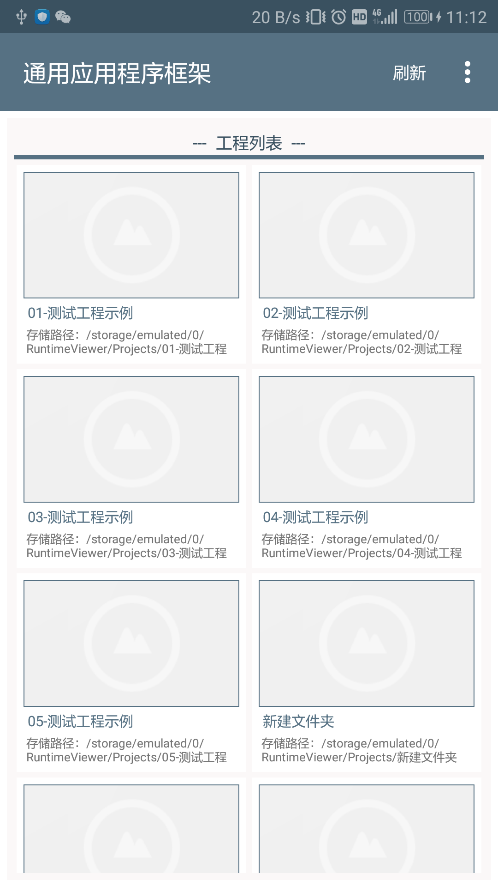
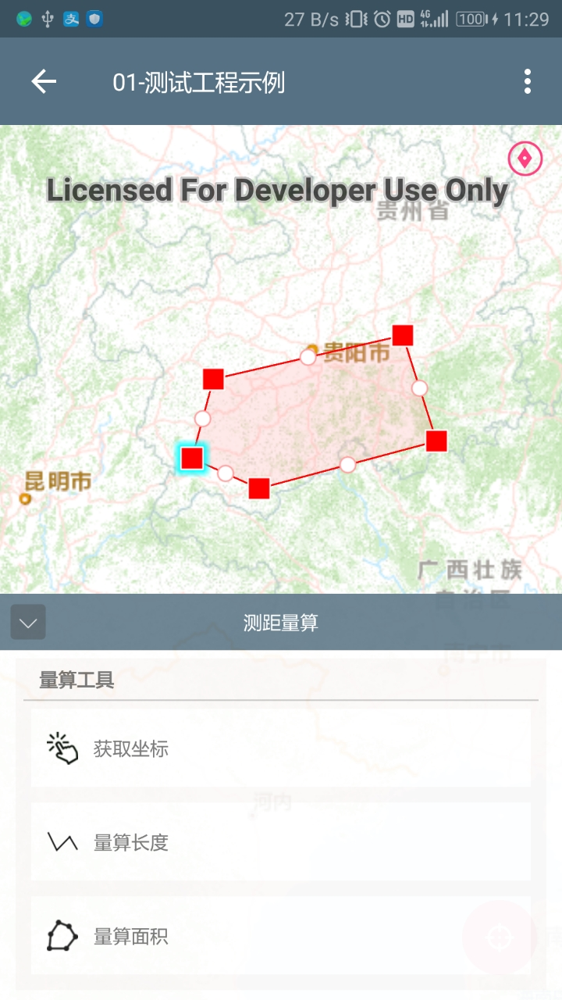

# RuntimeViewer
## —— 基于ArcGIS Runtime 100.x开发的移动应用程序框架

组件式开发框架，兼容手机、平板多种设备。

#### 平板模式


#### 手机模式
<div align=center></div>
<div align=center></div>

如何快速运行应用程序？
===========
* 使用git工具下来工程并将工程导入Android Studio
* 拷贝工程目录下/readme/工程结构示例/RuntimeViewer到手机存储根目录下（因为示例程序数据源均为离线）
* 运行应用程序

框架使用说明
======


项目采用插件化结构设计，文件夹架构说明如下
* Base —— 应用程序基类
* BMOD —— 业务功能模块
  * MapModule —— 地图模块
  * ProjectsModule —— 工程列表模块
  * RootAct —— 应用程序启动页
  * SystemModule —— 系统功能模块
* Common —— 公共功能
* Config —— App配置信息、初始化信息
* EventBus —— 事件中心
* GloabApp —— 应用程序全局信息Application
* Permission —— 权限控制
* Utils —— 工具类
* Widget —— 功能组件文件夹
  * Common —— 公共功能
  * LayerManagerWidget —— 图层管理
  * ……


配置文件说明
==============
```xml
<?xml version="1.0" ?>
<!--
App配置文件
-->
<configuration>
    <!--Runtime 许可-->
	    <runtimekey license="许可信息"/>

    <!--系统工作空间目录-->
    <workspace path="/RuntimeViewer"/>

    <!--widget组件列表-->
    <widgetcontainer>
        <widget label="图层管理" classname="com.gisluq.runtimeviewer.Widgets.LayerManagerWidget.LayerManagerWidget"  config=""/>
        <widget label="工程信息" classname="com.gisluq.runtimeviewer.Widgets.ProjectInfoWidget.ProjectInfoWidget"  config=""/>
        <widget label="Hello World" classname="com.gisluq.runtimeviewer.Widgets.HelloWorldWidget" config=""/>
    </widgetcontainer>
</configuration>
```
说明：
1. runtimekey的license为ArcGIS Runtime 1000.x许可信息，请获取后替换。
2. workspace的path为系统工作空间目录，设置后app会自动初始化文件夹结构信息
3. widget模块，label为应用程序名称，classname为对应widget类实体，程序加载过会自动初始化。必须填写。
  

框架功能模块开发
====================
### widget开发
#### 1. 创建widget组件类

在Widgets目录下创建HelloWorldWidget.java文件并添加以下内容。
建议类名的命名规则为 [业务名称+Widget].java 以保证统一。

```java
/**
 * 测试用组件
 * Created by gis-luq on 2018/3/10.
 */
public class HelloWorldWidget extends BaseWidget {

    public View mWidgetView = null;//
    /**
     * 组件面板打开时，执行的操作
     * 当点击widget按钮是, WidgetManager将会调用这个方法，面板打开后的代码逻辑.
     * 面板关闭将会调用 "inactive" 方法
     */
    @Override
    public void active() {

        super.active();//默认需要调用，以保证切换到其他widget时，本widget可以正确执行inactive()方法并关闭
        super.showWidget(mWidgetView);//加载UI并显示
        
        super.showMessageBox(super.name);//显示组件名称
    }

    /**
     * widget组件的初始化操作，包括设置view内容，逻辑等
     * 该方法在应用程序加载完成后执行
     */
    @Override
    public void create() {
        LayoutInflater mLayoutInflater = LayoutInflater.from(super.context);
        //设置widget组件显示内容
        mWidgetView = mLayoutInflater.inflate(R.layout.widget_view_helloworld,null);
    }

    /**
     * 组件面板关闭时，执行的操作
     * 面板关闭将会调用 "inactive" 方法
     */
    @Override
    public void inactive(){
        super.inactive();
    }

}
```

#### 2. 创建widget组件UI
在android工程的layout文件夹下创建widget_view_helloworld.xml文件，并添加如下内容。

```xml
<?xml version="1.0" encoding="utf-8"?>
<LinearLayout xmlns:android="http://schemas.android.com/apk/res/android"
    android:layout_width="fill_parent"
    android:layout_height="fill_parent"
    android:orientation="vertical">

    <LinearLayout
        android:orientation="vertical"
        android:layout_width="match_parent"
        android:layout_height="fill_parent"
        android:padding="10dp">

        <EditText
            android:layout_width="match_parent"
            android:layout_height="wrap_content"
            android:hint="信息" />

        <RelativeLayout
            android:layout_width="match_parent"
            android:layout_height="wrap_content"
            android:paddingTop="5dp">

            <Button
                style="?android:attr/buttonStyleSmall"
                android:layout_width="match_parent"
                android:layout_height="40dp"
                android:text="目标定位"
                android:id="@+id/widget_view_helloworld_button2"
                android:background="@drawable/ic_touch_btn"
                android:textColor="@color/white" />
        </RelativeLayout>
    </LinearLayout>
</LinearLayout>

```

#### 3、配置文件中添加对应内容
assents/config.xml下添加以下内容：
```xml
 <widget label="Hello World" classname="com.gisluq.runtimeviewer.Widgets.HelloWorldWidget" config=""/>
```


widget整体效果


### widget操作Mapview对象
每一个widget扩展了父类BaseWidget。使用以下方法就可以获取并操作mapview对象中的内容。
```java
super.mapView.getMap().getBasemap().getBaseLayers();//获取底图图层
super.mapView.getMap().getOperationalLayers();//获取业务图层

```

### widget通信
widget通信通过引入EventBus 3.0实现。基本使用如下：

#### 1. 订阅
```java
EventBus.getDefault().register(this);//订阅
```
#### 2. 解除订阅
```java
EventBus.getDefault().unregister(this);//解除订阅
```

#### 3. 发布事件
```java
EventBus.getDefault().post(new MessageEvent("事件说明"));
```

#### 4. 订阅事件处理
```java
@Subscribe(threadMode = ThreadMode.MAIN) //在ui线程执行
public void onDataSynEvent(MessageEvent event) {
    Log.e(TAG, "event---->" + event.getMessage());
    //通过判断message内容执行不同方法
}
```
ThreadMode总共四个：
* MAIN UI主线程
* BACKGROUND 后台线程
* POSTING 和发布者处在同一个线程
* ASYNC 异步线程

#### 5. 订阅事件优先级
事件的优先级类似广播的优先级，优先级越高优先获得消息
```java
@Subscribe(threadMode = ThreadMode.MAIN,priority = 100) //在ui线程执行 优先级100
public void onDataSynEvent(DataSynEvent event) {
    Log.e(TAG, "event---->" + event.getCount());
}
```

更多内容请参考EventBus 3.0详细相关材料：https://www.cnblogs.com/whoislcj/p/5595714.html


Widget示例
========
### 图层管理 LayerManagerWidget
实现功能包括：基础底图数据加载、业务图层加载（目前仅支持Shapefile），图层开启关闭、透明度控制、图例等。


#### 底图数据支持数据类型
* tpk - LocalTiledPackage
* server切片 - LocalServerCache
* tiff - LocalGeoTIFF
* 在线切片服务 - OnlineTiledMapServiceLayer
* 在线动态图层 - OnlineDynamicMapServiceLayer
* vtpk-LocalVectorTilePackage

##### 底图数据通过加载basemap.json实现，系统根目录/RuntimeViewer/XXX工程/BaseMap/basemap.json
文件内容如下，相关底图离线文件放在basemap.json所在文件夹即可。
```
{
    "baselayers": [
		{
            "name": "离线vtpk",
            "type": "LocalVectorTilePackage",
            "path": "china.vtpk",
            "layerIndex": 1,
            "visable": true,
            "opacity": 1
        },
		{
            "name": "彩色中文含兴趣点版中国基础地图",
            "type": "OnlineTiledMapServiceLayer",
            "path": "http://map.geoq.cn/arcgis/rest/services/ChinaOnlineCommunity/MapServer",
            "layerIndex": 2,
            "visable": true,
            "opacity": 1
        },
		{
            "name": "午夜蓝色中文不含兴趣点版中国基础地图",
            "type": "OnlineTiledMapServiceLayer",
            "path": "http://map.geoq.cn/arcgis/rest/services/ChinaOnlineStreetPurplishBlue/MapServer",
            "layerIndex": 3,
            "visable": false,
            "opacity": 1
        }
    ]
}
```

### 要素查询 QueryWidget
实现功能包括：图查属性、属性查图


### 要素编辑 FeatureEditWidget
实现功能包括：基于shapefile实现点、线、面要素添加，属性编辑，多媒体附件挂接（照片、视频、录音）


### 测量量算 CalculateWidget
实现功能包括：坐标获取、长度计算、面积计算


